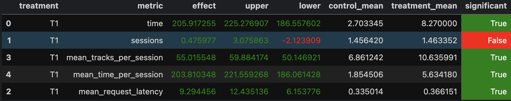

# Отчёт

### Abstract

Мы провели A/B-эксперимент, чтобы проверить, как влияет более умный алгоритм рекомендаций на поведение пользователей. В контрольной группе пользователи получали случайные треки. В тестовой — использовался наш новый алгоритм, который учитывает последние рекомендации и время прослушивания, чтобы подобрать следующий трек. Цель — повысить вовлечённость.

---

### Детали реализации

Алгоритм использует заранее подготовленные персонализированные списки треков из Redis. Он:
1) Продвигается по списку от предыдущего трека.
2) Учитывает время прослушивания:
3) < 1 сек: делает большой шаг вперёд (на 3 трека)
4) < 5 сек: средний шаг (2 трека)
5) иначе: обычный шаг (1 трек)
6) Избегает повторов — треки, которые уже были недавно показаны, не рекомендуются повторно (сохраняется deque с историей).
7) Если все треки уже были — срабатывает fallback.

---

### Инструкция по запуску

```
cd /botify/
docker compose up -d --build --force-recreate --scale recommender=2
```

```
cd ../sim/
python -m sim.run --episodes 10000 --config config/env.yml multi --processes 8
```

```
cd ../script/
python3 dataclient.py --recommender 2 log2local ../data-rec/data
```

---

### Для A/B запускаем jupyter/Week1Seminar.ipynb

